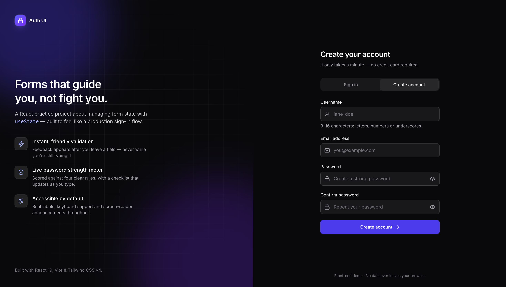
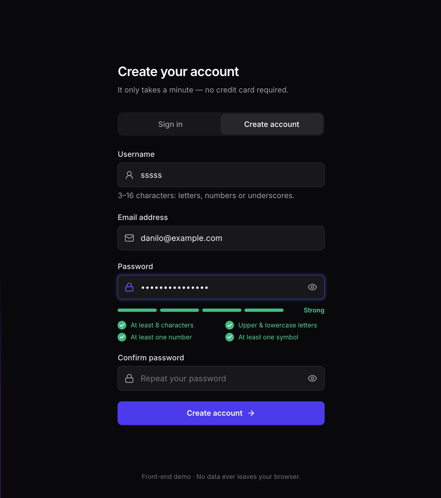
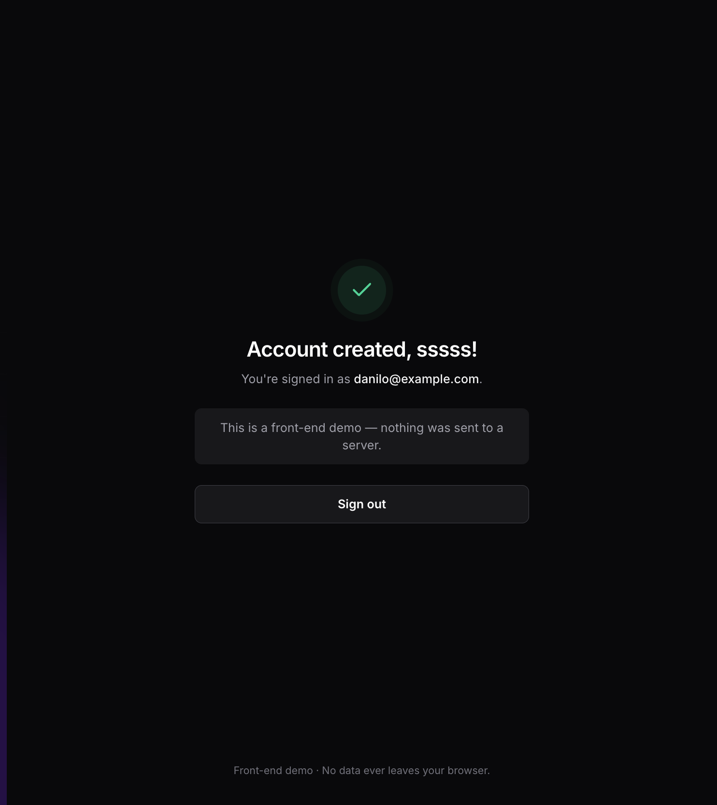
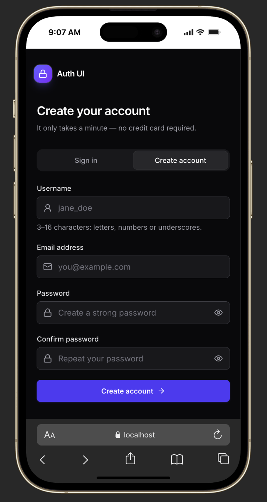
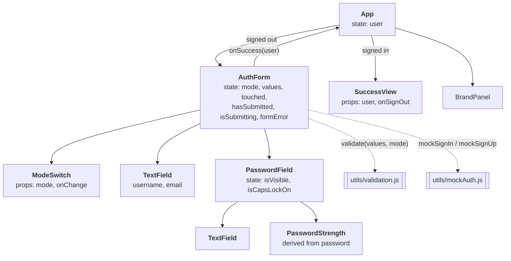

<div align="center">


# Auth UI — React Sign-in & Sign-up Form

**A production-quality authentication UI built to master form state in React with nothing but `useState`.**

Real-time validation · Password strength meter · Accessible · Responsive · Light & dark mode


<!-- TODO: add the live demo link here, e.g. **[Live demo →](https://your-demo-url)** -->

</div>



## Table of contents

- [About the project](#about-the-project)
- [Features](#features)
- [Screenshots](#screenshots)
- [Tech stack](#tech-stack)
- [Getting started](#getting-started)
- [Project structure](#project-structure)
- [Architecture](#architecture)
- [State management decisions](#state-management-decisions)
- [Validation rules](#validation-rules)
- [Accessibility](#accessibility)
- [Learning sandbox: `event_handler/`](#learning-sandbox-event_handler)
- [Roadmap](#roadmap)
- [What I learned](#what-i-learned)
- [Author](#author)

## About the project

Login forms look simple, but they are one of the best places to practise **state management**: several inputs, two modes, validation that depends on other fields, async submission, loading and error states, and a success screen.

The goal of this project was to build that whole flow **using only `useState`** — no form libraries, no global state, no `useEffect` — and make it look and behave like a real product.

> **Front-end only by design.** There is no backend. A small mock API ([`src/utils/mockAuth.js`](src/utils/mockAuth.js)) simulates network latency and server errors so the loading and error states can be shown. No data leaves the browser.

## Features

| | Feature | Details |
|---|---|---|
| 🔀 | **Sign in / Create account** | Animated segmented control. Typed values are kept when switching modes. |
| ⚡ | **Friendly real-time validation** | Errors appear only after you leave a field or submit — never on the first keystroke. |
| 🔐 | **Password strength meter** | 4-segment bar and a live checklist of rules (length, case, number, symbol). |
| 👁️ | **Show / hide password** | Accessible toggle button with `aria-pressed`. |
| ⇪ | **Caps Lock warning** | Detected with `KeyboardEvent.getModifierState()`. |
| ⏳ | **Async submit states** | Spinner, disabled form while submitting, server error banner. |
| ✅ | **Success screen** | Focus moves to the heading so screen-reader users hear the result. |
| 🎯 | **Focus management** | On a failed submit, focus jumps to the first invalid field. |
| 🌗 | **Light & dark mode** | Follows `prefers-color-scheme`. |
| 📱 | **Responsive** | Split layout on desktop, single column on mobile. |

**Try it:** create an account with the username `admin` to see how a server error is handled.

## Screenshots

| Password strength meter | Success state | Mobile |
|:---:|:---:|:---:|
|  |  |  |

## Tech stack

| Area | Choice | Why |
|---|---|---|
| UI library | **React 19** | Function components and hooks. |
| Build tool | **Vite 7** | Instant dev server and fast production builds. |
| Styling | **Tailwind CSS 4** | Utility-first styling, dark mode via `dark:` variant, custom animation tokens in `@theme`. |
| Icons | **Inline SVG components** | Crisp at any size, inherit `currentColor`, zero extra dependencies. |
| Code quality | **ESLint 9** + `react-hooks` plugin | Catches hook mistakes and unused code. |

The only runtime dependencies are `react` and `react-dom`.

## Getting started

**Requirements:** Node.js 20.19+ or 22.12+ (required by Vite 7).

```bash
git clone https://github.com/DaniloK77/LOGIN-FORM.git
cd LOGIN-FORM
npm install
npm run dev
```

Then open <http://localhost:5173>.

| Script | What it does |
|---|---|
| `npm run dev` | Starts the dev server with hot reload. |
| `npm run build` | Creates an optimized production build in `dist/`. |
| `npm run preview` | Serves the production build locally. |
| `npm run lint` | Runs ESLint. |

## Project structure

```text
src/
├── main.jsx                  # Entry point
├── App.jsx                   # Layout + "who is signed in" state
├── index.css                 # Tailwind import, theme tokens, animations
├── components/
│   ├── AuthForm.jsx          # Form state, validation display, submit flow
│   ├── ModeSwitch.jsx        # Sign in / Create account segmented control
│   ├── TextField.jsx         # Reusable labelled input with icon, hint and error
│   ├── PasswordField.jsx     # TextField + show/hide toggle + Caps Lock warning
│   ├── PasswordStrength.jsx  # Strength bar and rules checklist
│   ├── SuccessView.jsx       # Shown after a successful sign-in / sign-up
│   ├── BrandPanel.jsx        # Desktop-only marketing panel
│   ├── Logo.jsx
│   └── Icons.jsx             # Inline SVG icon set
└── utils/
    ├── validation.js         # Pure validation + password scoring functions
    └── mockAuth.js           # Simulated API (latency + errors)
```

The split follows one rule: **components render, utilities decide.** All validation lives in pure functions that take values and return results, so they are easy to read, reuse and unit-test.

## Architecture



**Data flow in one sentence:** `AuthForm` owns the form state, derives errors from it on every render, calls the mock API on submit and reports the signed-in user up to `App`, which decides which screen to show.

### Where each piece of state lives

| Component | State | Why it lives here |
|---|---|---|
| `App` | `user` | Both the form and the success screen depend on it → lifted to the closest common parent. |
| `AuthForm` | `mode`, `values`, `touched`, `hasSubmitted`, `isSubmitting`, `formError` | Everything the form needs to render and submit. |
| `PasswordField` | `isVisible`, `isCapsLockOn` | Purely local UI state — no other component cares about it. |
| — | `errors`, password `score` | **Not state.** Calculated from `values` during render. |

## State management decisions

These are the patterns this project was built to practise.

**1. Derive, don't sync.**
Errors and password strength are calculated from the current values instead of being stored in state. There is nothing to keep in sync, so whole classes of bugs (stale error messages, forgotten resets) cannot happen.

```jsx
const errors = validate(values, mode); // recalculated on every render
```

**2. One object for related fields, one handler for all inputs.**

```jsx
const handleChange = (event) => {
  const { name, value } = event.target;
  setValues((prev) => ({ ...prev, [name]: value }));
};
```

**3. Reset state in event handlers, not in `useEffect`.**
Switching modes resets `touched`, `hasSubmitted` and `formError` directly in the click handler. This avoids an extra render and the "sync state with an effect" anti-pattern ([You Might Not Need an Effect](https://react.dev/learn/you-might-not-need-an-effect)).

**4. Functional updates when the next state depends on the previous one.**
`setTouched((prev) => ({ ...prev, [name]: true }))` and `setIsVisible((visible) => !visible)` are always correct, even when updates are batched.

**5. "Reward early, punish late" validation UX.**
An error is only shown once the user has left a non-empty field or tried to submit. When a field becomes valid, the error disappears immediately.

**6. Colocate state.**
Show/hide and Caps Lock state live inside `PasswordField`, so the parent form stays focused on data, not on UI details.

## Validation rules

| Field | Mode | Rule |
|---|---|---|
| Username | Sign up | Required · 3–16 characters · letters, numbers, underscores |
| Email | Both | Required · valid email format |
| Password | Sign in | Required |
| Password | Sign up | Required · strength score ≥ 3 out of 4 |
| Confirm password | Sign up | Required · must match the password |

**Password score (0–4)** = number of rules passed: at least 8 characters · upper and lowercase letters · a number · a symbol. Length is a hard gate: a password shorter than 8 characters can never score above 1, whatever else it contains.

## Accessibility

- Every input has a real `<label>`; hints and errors are linked with `aria-describedby`.
- Invalid fields are marked with `aria-invalid`; server errors use `role="alert"`.
- Password strength changes are announced through an `aria-live` region.
- Correct `autocomplete` values (`email`, `username`, `new-password`, `current-password`) so password managers work.
- Fully keyboard-operable with visible `:focus-visible` outlines.
- Entrance animations are disabled for users who prefer reduced motion (`motion-safe:`).

## Learning sandbox: `event_handler/`

The [`event_handler/`](event_handler) folder is a separate Vite app where I practised the fundamentals behind this form, following the **Adding Interactivity** and **Managing State** chapters of [react.dev](https://react.dev/learn). It covers event handlers, state as a snapshot, batching and updater functions, updating objects and arrays immutably (including with Immer), and sharing state between components.

See [`event_handler/README.md`](event_handler/README.md) for the full list of exercises.

## Roadmap

- [ ] Unit tests for `validation.js` and interaction tests with **Vitest** + **React Testing Library**
- [ ] Deploy and add a live demo link
- [ ] Migrate to **TypeScript**
- [ ] Compare the same form built with `useReducer` and with React Hook Form + Zod
- [ ] Manual light/dark theme toggle

## What I learned

- Most "form bugs" come from **duplicated state**. Calculating values during render removed the need for `useEffect` completely.
- **Where state lives** matters as much as what it holds: lifting `user` up and keeping UI-only state local made each component simpler.
- Good validation is a **UX problem**, not just a regex problem — *when* you show an error matters as much as *what* it says.
- Accessibility is mostly about **wiring**: labels, ARIA relationships and focus management cost little when they are planned from the start.

## Author

**Danilo Kovačević** — ETF student and full-stack developer from Nikšić, Montenegro.

[](https://github.com/DaniloK77)
